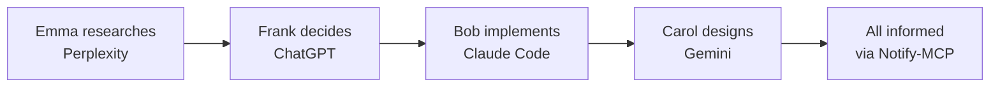

# Cross-Platform AI Collaboration

**Problem:** Teams use different AI assistants (Claude, ChatGPT, Gemini, Perplexity) based on personal preference, specialty, or availability—creating information silos where critical knowledge stays trapped in individual AI conversations.

**Solution:** Notify-MCP breaks down AI platform barriers by providing a unified notification layer that works seamlessly across all MCP-compatible AI assistants, enabling true cross-platform collaboration.

---

## The Challenge

Modern teams leverage multiple AI platforms, but face fragmentation:

- **Developer A** has critical insights from Claude Code sessions that **Developer B** (using ChatGPT) never sees
- **Designer using Gemini** makes UI decisions that **Frontend team using Claude** discovers weeks later
- **Data Scientist using Perplexity** finds important research that stays siloed in their conversation
- **Team knowledge** scattered across incompatible platforms with no way to share

This AI platform fragmentation causes:

- ❌ Duplicated research across team members
- ❌ Lost insights and discoveries
- ❌ Inconsistent understanding of project state
- ❌ Wasted time rediscovering the same information
- ❌ Inability to leverage each AI's unique strengths together

---

## How Notify-MCP Solves This

### Platform-Agnostic Communication

Any AI assistant can publish to and subscribe from Notify-MCP channels—no platform lock-in.

### Unified Knowledge Base

Insights from Claude, ChatGPT, Gemini, and others all flow into a single, searchable notification history.

### Leverage AI Strengths

Teams can use the best AI for each task (Claude for coding, ChatGPT for ideation, Gemini for research) while maintaining seamless communication.

### MCP Standard Compliance

Built on Model Context Protocol—works with any MCP-compatible AI assistant, present and future.

### Persistent Cross-Platform History

All notifications stored regardless of source AI platform, creating a permanent team knowledge base.

---

## Real-World Scenario

### Scenario: Cross-Functional AI Team Building E-Commerce Platform

**Team:** 6 people using different AI assistants based on their needs and preferences

**AI Platform Distribution:**
- **Alice (Backend Lead):** Claude Code (best for backend development)
- **Bob (Frontend Dev):** ChatGPT Plus (preferred for React)
- **Carol (Designer):** Gemini (excellent for creative work)
- **David (DevOps):** Claude (great for infrastructure as code)
- **Emma (Data Analyst):** Perplexity (superior research capabilities)
- **Frank (Product Manager):** ChatGPT (accessible, good for planning)

---

### Day 1: Backend Architectural Decision (Claude)

**Alice (Backend Lead, using Claude Code):**

```markdown
Alice: "I need to decide between PostgreSQL and MongoDB for our e-commerce
database. Let's discuss this."

Claude: "Let me analyze both options... Based on your e-commerce requirements
(ACID transactions, relational data, complex queries), I recommend PostgreSQL.
Shall I publish this architectural decision?"

Alice: "Yes, publish it to the architecture channel so the whole team knows."

# Notification sent via Claude:
{
  "channel": "architecture",
  "title": "Database Decision: PostgreSQL Selected",
  "body": "## Decision\n\nUsing PostgreSQL for e-commerce platform database.\n\n
  ## Rationale\n\n**PostgreSQL chosen over MongoDB because:**\n- ACID transactions
  critical for order processing\n- Relational data model (users, orders, products)\n
  - Complex JOIN queries for analytics\n- JSON support available for flexible
  fields\n- Better consistency guarantees\n\n## Impact\n\n- Backend: Using
  SQLAlchemy ORM\n- DevOps: Postgres container in Docker Compose\n- Data team:
  SQL queries for analytics\n\nTeam: Please design your components with relational
  model in mind.",
  "priority": "high",
  "theme": "architecture-decision",
  "tags": ["database", "postgresql", "architecture"],
  "sender": {
    "name": "Alice Chen",
    "role": "Backend Lead",
    "ai_tool": "Claude Code"
  }
}
```

---

### Day 1 (2 hours later): Frontend Developer Sees Decision (ChatGPT)

**Bob (Frontend Dev, using ChatGPT Plus):**

```markdown
Bob: "Are there any architecture decisions I should know about for the e-commerce
project?"

ChatGPT: "Yes! Alice made a database decision 2 hours ago. She selected PostgreSQL
over MongoDB for ACID transactions and relational data modeling. This affects
your frontend because:

1. API will return relational data structures
2. GraphQL might be a good fit for complex queries
3. You can expect strong consistency guarantees

The backend is using SQLAlchemy ORM. Would you like me to help design the API
interface?"

Bob: "Perfect! Yes, let's design the API with that in mind."
```

---

### Day 2: Design System Research (Gemini)

**Carol (Designer, using Gemini):**

```markdown
Carol: "I've been researching e-commerce design patterns. What are the best
practices for product listing pages?"

Gemini: "I've found excellent research on e-commerce UX patterns... [extensive
analysis]. The key findings suggest a card-based layout with lazy loading and
quick-view functionality performs best."

Carol: "This is valuable for the whole team. Publish these design insights."

# Notification sent via Gemini:
{
  "channel": "design",
  "title": "UX Research: E-Commerce Product Listing Best Practices",
  "body": "## Key Findings\n\nResearched e-commerce UX patterns across top 50
  online retailers.\n\n## Product Listing Recommendations\n\n1. **Card-based
  layout** (4 columns desktop, 2 mobile)\n2. **Lazy loading** (load 20 products,
  infinite scroll)\n3. **Quick view modal** (preview without leaving list)\n
  4. **Filter sidebar** (collapsible on mobile)\n5. **Sort dropdown** (price,
  popularity, rating)\n\n## Performance Impact\n\n- Card layout: 35% higher
  engagement vs. list\n- Quick view: 22% reduction in bounce rate\n- Lazy loading:
  58% faster initial load\n\n## Design Files\n\nFigma link: [Design System]\n\n
  ## Implementation Notes\n\nFrontend: Will need pagination API endpoint\nBackend:
  Consider caching strategy for product data\n\nStudies referenced: Nielsen
  Norman, Baymard Institute",
  "priority": "medium",
  "theme": "research-findings",
  "tags": ["ux", "design", "research", "product-listing"],
  "sender": {
    "name": "Carol Martinez",
    "role": "Product Designer",
    "ai_tool": "Gemini"
  }
}
```

---

### Day 2 (Evening): DevOps Sees Both Updates (Claude)

**David (DevOps Engineer, using Claude):**

```markdown
David: "What do I need to know for setting up the e-commerce infrastructure?"

Claude: "Let me check the architecture and design channels... Here's what you
need to know:

**From Alice (via Claude Code):**
- Database: PostgreSQL selected
- ORM: SQLAlchemy
- Need: Postgres container in Docker Compose

**From Carol (via Gemini):**
- Frontend will use card-based product listings with lazy loading
- Backend needs pagination API + caching strategy for product data
- Performance is critical (58% faster initial load with lazy loading)

For your infrastructure planning:
1. PostgreSQL container with persistent volume
2. Redis for product data caching (Carol's performance requirement)
3. CDN for product images (Carol's fast loading requirement)
4. Load balancer for horizontal scaling

Would you like me to help draft the Docker Compose configuration?"

David: "Yes! And publish the infrastructure decision so everyone knows."
```

---

### Day 3: Data Analyst Research (Perplexity)

**Emma (Data Analyst, using Perplexity):**

```markdown
Emma: "Research customer behavior patterns in e-commerce checkout flows. What
are the key drop-off points?"

Perplexity: "Based on recent e-commerce research (2024 studies), here are the
critical drop-off points... [comprehensive research]. The data shows 68% of
carts are abandoned, with these primary causes..."

Emma: "This is critical for the team. Publish these insights."

# Notification sent via Perplexity:
{
  "channel": "product-insights",
  "title": "Research: E-Commerce Checkout Drop-off Patterns",
  "body": "## Cart Abandonment Research\n\n**68% of e-commerce carts are abandoned.**
  \n\n## Primary Drop-off Points\n\n1. **Unexpected shipping costs** (55%)\n
  2. **Account creation required** (34%)\n3. **Complex checkout process** (27%)\n
  4. **Payment security concerns** (19%)\n5. **Slow page load times** (18%)\n\n
  ## Recommendations for Our Platform\n\n✅ **Show shipping costs early** (before
  checkout)\n✅ **Guest checkout option** (no forced account creation)\n✅
  **Single-page checkout** (minimize steps)\n✅ **Trust signals** (security badges,
  SSL)\n✅ **Performance optimization** (<2s page load)\n\n## Impact on Design\n\n
  **Carol (Design):** Consider guest checkout UI\n**Bob (Frontend):** Single-page
  checkout component\n**Alice (Backend):** Guest user order processing\n**David
  (DevOps):** Optimize checkout page performance\n\nSources: Baymard Institute
  2024, Statista E-Commerce Report",
  "priority": "high",
  "theme": "research-findings",
  "tags": ["ux", "checkout", "conversion", "research"],
  "sender": {
    "name": "Emma Watson",
    "role": "Data Analyst",
    "ai_tool": "Perplexity"
  }
}
```

---

### Day 3: Product Manager Synthesis (ChatGPT)

**Frank (Product Manager, using ChatGPT):**

```markdown
Frank: "Summarize all the key decisions and research from this week for our
sprint planning."

ChatGPT: "Here's a comprehensive summary from the architecture, design, and
product-insights channels:

## Technical Decisions

**Database (Alice via Claude Code):**
- PostgreSQL selected for ACID transactions and relational model
- Using SQLAlchemy ORM

**Infrastructure (David via Claude):**
- Docker Compose with Postgres + Redis
- CDN for product images
- Horizontal scaling via load balancer

## UX Research

**Product Listing (Carol via Gemini):**
- Card-based layout with lazy loading
- Quick view modal functionality
- Pagination + caching strategy needed

**Checkout Optimization (Emma via Perplexity):**
- Guest checkout required (34% drop-off from forced accounts)
- Show shipping costs early (55% cite unexpected costs)
- Single-page checkout (minimize steps)
- Performance critical (<2s load time)

## Sprint Planning Implications

Based on this cross-platform research:
1. **Sprint 1:** Database schema + basic product listing API
2. **Sprint 2:** Product listing UI (card layout + lazy loading)
3. **Sprint 3:** Guest checkout flow with early shipping calculation
4. **Sprint 4:** Performance optimization + caching

All team members contributed valuable insights using their preferred AI platforms!
Would you like me to publish this sprint plan?"

Frank: "Yes, publish it. This is a perfect example of cross-platform AI collaboration!"
```

---

## Benefits Demonstrated

### 🌐 **Platform Independence**

- **5 different AI platforms used:** Claude Code, ChatGPT Plus, Gemini, Perplexity, Claude
- **Zero communication friction** between platforms
- **Everyone informed** regardless of their AI choice

### 🧠 **Leverage AI Strengths**

- **Claude Code:** Alice used it for backend architectural decisions (coding strength)
- **Gemini:** Carol used it for creative UX research (creative strength)
- **Perplexity:** Emma used it for deep research (research strength)
- **ChatGPT:** Frank used it for synthesis and planning (general-purpose strength)

**Result:** Team got the best of all AI platforms without silos.

### 🔄 **Seamless Knowledge Flow**

- Alice's PostgreSQL decision (Claude) → Informed Bob's frontend work (ChatGPT)
- Carol's UX research (Gemini) → Guided David's infrastructure (Claude)
- Emma's checkout research (Perplexity) → Shaped Frank's sprint plan (ChatGPT)

### 📚 **Unified Knowledge Base**

- All insights stored in one place regardless of source AI
- Anyone can query complete project history
- No information lost to platform silos

### 🚀 **Faster Decision Making**

- **Before:** Wait for meetings to share insights from different AI platforms
- **After:** Instant knowledge sharing across all platforms
- **Impact:** 10x faster information propagation

---

## Implementation Guide

### 1. Set Up Cross-Platform Channels

```markdown
# Create channels for different types of information
"Create channels: architecture, design, product-insights, engineering"
```

### 2. Subscribe Team Members (Any AI Platform)

```markdown
# In Claude:
"Subscribe me to architecture and engineering channels"

# In ChatGPT:
"Subscribe me to design and product-insights channels"

# In Gemini:
"Subscribe me to all project channels"

# Result: Everyone synchronized regardless of AI platform
```

### 3. Publish from Any Platform

```markdown
# Any team member using any AI assistant can publish
"Publish this architectural decision to the architecture channel"

# Works identically in Claude, ChatGPT, Gemini, Perplexity, etc.
```

### 4. Retrieve from Any Platform

```markdown
# Query notifications from any AI assistant
"Show me recent architecture decisions"
"What research has been published this week?"
"Summarize all design discussions"

# Every AI assistant can access the same notification history
```

---

## Cross-Platform Collaboration Patterns

### Pattern 1: Research → Decision → Implementation



**Example:**
1. Emma (Perplexity) researches checkout best practices
2. Frank (ChatGPT) reviews research and decides on guest checkout
3. Bob (Claude Code) implements guest checkout API
4. Carol (Gemini) designs guest checkout UI
5. All stay informed via Notify-MCP

### Pattern 2: Parallel Workstreams, Unified Communication

```markdown
# Four team members working simultaneously on different AI platforms

**10:00 AM** - Alice (Claude Code): "Backend API ready for testing"
**10:15 AM** - Carol (Gemini): "Mobile designs updated in Figma"
**10:30 AM** - Emma (Perplexity): "Performance benchmark results published"
**10:45 AM** - David (Claude): "Staging environment deployed"

# All updates visible to everyone regardless of their AI platform
```

### Pattern 3: AI-Specific Expertise Sharing

```markdown
# Leverage each AI's unique strengths

**Claude Code** (coding expertise):
- Architectural decisions
- Code review insights
- Implementation patterns

**Gemini** (creative/research):
- Design research
- UX patterns
- Creative solutions

**ChatGPT** (general-purpose):
- Planning and synthesis
- Documentation
- Communication

**Perplexity** (deep research):
- Market research
- Technical investigations
- Best practices analysis

All insights flow into unified Notify-MCP knowledge base.
```

---

## Advanced Cross-Platform Scenarios

### Scenario 1: AI Platform Outage Resilience

**ChatGPT experiences an outage:**

```markdown
# Bob normally uses ChatGPT, but it's down
Bob (switching to Claude): "Show me the latest project updates"

Claude: "Here are updates from the last 24 hours:
- Alice published API changes (via ChatGPT before outage)
- Carol updated design system (via Gemini)
- David completed database migration (via Claude)

You have full context even though ChatGPT is down. Would you like me to help
with your frontend work?"

Bob: "Yes! Good thing we have all the context preserved."
```

**Benefit:** Team resilience—no single point of failure.

### Scenario 2: Multi-AI Conversation Threading

**Complex discussion across multiple AI platforms:**

```markdown
# Thread starts in Claude (Alice)
{
  "title": "Proposal: GraphQL API Layer",
  "thread_id": "graphql-discussion",
  "ai_tool": "Claude"
}

# Bob responds via ChatGPT
{
  "title": "Re: GraphQL Proposal - Frontend Perspective",
  "thread_id": "graphql-discussion",
  "in_reply_to": "msg-alice-proposal",
  "ai_tool": "ChatGPT"
}

# Carol adds design input via Gemini
{
  "title": "Re: GraphQL - Design System Integration",
  "thread_id": "graphql-discussion",
  "in_reply_to": "msg-bob-frontend",
  "ai_tool": "Gemini"
}

# Result: Threaded conversation across three AI platforms
```

### Scenario 3: AI Platform Preference Switching

**Developer switches AI platforms mid-project:**

```markdown
# Week 1: Bob using ChatGPT
Bob (ChatGPT): "Subscribe me to architecture and engineering channels"
[Works on frontend all week]

# Week 2: Bob switches to Claude Code for better coding assistance
Bob (Claude Code): "Show me what I missed from the architecture channel"

Claude Code: "Here's your complete history from when you subscribed:
- 12 architectural decisions
- 8 engineering updates
- 3 blockers (all resolved)

Full context preserved even though you switched AI platforms. Would you like
a summary or detailed review?"

Bob: "Summary please. This is great—no context lost!"
```

---

## Platform Comparison: With vs. Without Notify-MCP

### Without Notify-MCP (Siloed AI Platforms)

```markdown
❌ Alice's insights in Claude stay in Claude
❌ Bob's discoveries in ChatGPT stay in ChatGPT
❌ Carol's research in Gemini stays in Gemini
❌ Team must schedule meetings to share knowledge
❌ Information loss between platforms
❌ Duplicated research across team members
❌ Can't leverage each AI's unique strengths together
```

### With Notify-MCP (Unified AI Collaboration)

```markdown
✅ Alice publishes insights from Claude → Everyone sees it
✅ Bob shares discoveries from ChatGPT → Team synchronized
✅ Carol broadcasts research from Gemini → Full visibility
✅ Real-time knowledge sharing across all platforms
✅ Zero information loss
✅ No duplicated work
✅ Leverage best AI for each task while staying connected
```

---

## Best Practices for Cross-Platform Teams

### ✅ Do This

- **Use the best AI for each task** - Don't force platform standardization
- **Publish important insights** - Share discoveries from any platform
- **Tag with AI tool** - Sender metadata includes which AI was used
- **Cross-reference threads** - Link related discussions across platforms
- **Embrace platform diversity** - Different AIs bring different strengths

### ❌ Avoid This

- **Don't force platform standardization** - Let team members choose their preferred AI
- **Don't duplicate notifications** - Publish once, visible everywhere
- **Don't assume platform availability** - Design for resilience
- **Don't create platform-specific channels** - Keep channels platform-agnostic
- **Don't ignore sender context** - Note which AI tool generated insights

---

## Measuring Cross-Platform Success

### Collaboration Metrics

- **Platform diversity:** How many different AI platforms are actively used?
- **Knowledge sharing:** How often do insights from one AI inform work on another?
- **Information silos:** Reduced incidents of "I didn't know that"
- **Platform outage resilience:** Can team continue during AI platform outages?

### Expected Outcomes

- ✅ **100% cross-platform visibility** - No information silos
- ✅ **Team uses 3+ AI platforms** - Leverage different AI strengths
- ✅ **Zero context loss** - Platform switches don't lose history
- ✅ **Faster innovation** - Best AI for each task + unified communication
- ✅ **Outage resilience** - Team continues working during platform issues

---

## Future-Proof AI Collaboration

### MCP Standard Benefits

Notify-MCP is built on the **Model Context Protocol (MCP)** standard by Anthropic:

- ✅ **Works with all MCP-compatible AI assistants** (current and future)
- ✅ **No vendor lock-in** - Switch AI platforms freely
- ✅ **Future-proof** - New AI assistants automatically compatible
- ✅ **Open standard** - Growing ecosystem of MCP tools

### As New AI Platforms Emerge

```markdown
# Today: Claude, ChatGPT, Gemini, Perplexity
Team uses Notify-MCP for cross-platform collaboration ✅

# Tomorrow: New AI platforms launch (GPT-5, Claude 5, Gemini Ultra, etc.)
New AI platform supports MCP → Notify-MCP works immediately ✅

# Future: AI landscape evolves
Team can adopt new AI tools without losing collaboration capabilities ✅
```

---

## Integration Scenarios

### Scenario: Hybrid Human-AI Teams

```markdown
# Mix of human communication and AI-assisted work

**Human Developer (Slack):**
"API is ready for frontend integration"

**AI Assistant (Claude Code via Notify-MCP):**
{
  "title": "API Integration Ready - Automated Tests Passing",
  "body": "Backend API deployed to staging. All integration tests passing.
  Frontend team can proceed.\n\nAutomated notification triggered by CI/CD pipeline."
}

**Frontend Dev (ChatGPT):**
"Great! Starting frontend integration now."

Result: Seamless blend of human and AI communication via unified platform
```

---

## Next Steps

1. **[Install Notify-MCP](../getting-started/installation.md)** - Works with all MCP-compatible AI assistants
2. **[Create shared channels](../getting-started/quick-start.md)** - Start cross-platform collaboration
3. **[Subscribe from any AI platform](../api-reference/tools.md)** - Claude, ChatGPT, Gemini, etc.
4. **[Publish from any platform](../guides/best-practices.md)** - Zero platform barriers

---

## Related Use Cases

- **[Team Coordination](team-coordination.md)** - Coordinate distributed teams
- **[Architecture Decisions](architecture-decisions.md)** - Share technical decisions
- **[Real-World Scenarios](real-world-scenarios.md)** - Complete workflow examples

---

**Ready to break down AI platform silos? [Get started with Notify-MCP today!](../getting-started/installation.md)**
